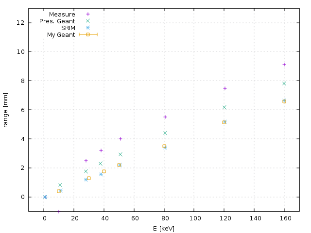

$Id: README 93675 2015-10-28 09:59:23Z gcosmo $
-------------------------------------------------------------------

     =========================================================
     Geant4 - an Object-Oriented Toolkit for Simulation in HEP
     =========================================================

                   IonRange (based on TestEm7) 
                   ---------------------------

 to compute range of low energy ions in a gas

	

 plot made with `C12.mac` and `plot.gp`

 1- GEOMETRY DEFINITION
 
     The geometry consists of a single block of a homogenous material,
     placed in a world.
     	
     Three parameters define the geometry :
 	- the material of the box,
	- the thickness of the box (sizeX),
	- the transverse dimension of the box (sizeYZ).
	
     The default is 20 cm of water.
     	 	
     In addition a transverse uniform magnetic field can be applied.
 	
     The default geometry is constructed in DetectorConstruction class,
     but all of the above parameters can be changed interactively via
     the commands defined in the DetectorMessenger class.
     
     The size, matter, positions of several test-volumes (tallies) can be
     defined via UI commands : /testem/det/tally...    
 	
 2- PHYSICS LIST
 
 Physics lists can be local (eg. in this example) or from G4 kernel
 physics_lists subdirectory.
     
 Local physics lists:	 
 - "local"	standard EM physics with current 'best' options setting.
                these options are explicited in PhysListEmStandard		
 - "standardSS" standard EM physics with single Coulomb scattering 
                instead of multiple scattering; 
 - "standardNR" standard EM physics with single Coulomb scattering 
                process G4ScreenedNuclearRecoil instead of the 
                multiple scattering for ions with energy less than 
                100 MeV/nucleon; the new process was developed 
                by M.H. Mendenhall and R.A. Weller from Vanderbuilt 
                University and published in NIM B 277 (2005) 420.
                In later Geant4 releases the process will be a part
                of Geant4 source, currently it is released together
                with its mathematical tool c2_functions in current 
    
 From geant4/source/physics_lists/builders:	 
 - "emstandard_opt0" recommended standard EM physics for LHC
 - "emstandard_opt1" best CPU performance standard physics for LHC
 - "emstandard_opt2" similar fast simulation
 - "emstandard_opt3" best standard EM options - analog to "local" above
 - "emstandard_opt4" best current advanced EM options standard + lowenergy
 - "emstandardWVI" standard EM physics and WentzelVI multiple scattering
 - "emstandardSS"  standard EM physics and single scattering model
 - "emstandardGS"  standard EM physics and Goudsmit-Saunderson multiple scatt.
 - "emlivermore"  low-energy EM physics using Livermore data
 - "empenelope"   low-energy EM physics implementing Penelope models
 - "emlowenergy"  low-energy EM physics implementing experimental
                  low-energy models
  
 Decay and StepMax processes are added to each list. 

 Optional components can be added:
 - "elastic"       elastic scattering of hadrons
 - "HElastic"
 - "QElastic"    
 - "binary"        QBBC configuration of hadron inelastic models
 - "binary_ion"    Binary ion inelastic models
 - "ionIoni"       Ion gas models
     		        
 Physics lists and options can be (re)set with UI commands
    
 Please, notice that options set through G4EmProcessOptions are global, eg
 for all particle types. In G4 builders, it is shown how to set options per
 particle type.		
 	 
 3- AN EVENT : THE PRIMARY GENERATOR
 
     The primary kinematic consists of a single particle which hits the
     block perpendicular to the input face. The type of the particle
     and its energy are set in the PrimaryGeneratorAction class, and can
     changed via the G4 build-in commands of G4ParticleGun class (see
     the macros provided with this example).
     The default is a 160 MeV proton.
     	
     In addition one can define randomly the impact point of the incident
     particle. The corresponding interactive command is built in
     PrimaryGeneratorMessenger class.
	 	
     A RUN is a set of events.

 4- DOSE IN 'TEST-VOLUMES'
  
     The energy deposited in the test-volumes (tallies) defined in
     DetectorConstruction are printed at EndOfRun, both in MeV and gray.
 				
 5- VISUALIZATION
 
     The Visualization Manager is set in the main().
     The initialisation of the drawing is done via the command
     > /control/execute vis.mac
 	
     The detector has a default view which is a longitudinal view of the box.
 	
     The tracks are drawn at the end of event, and erased at the end of run.
     Optionally one can choose to draw all particles, only the charged one,
     or none. This command is defined in EventActionMessenger class.
     
 6- HOW TO START ?
 
     - execute Test  in 'batch' mode from macro files
 	% TestEm7    proton.mac
 		
     - execute Test  in 'interactive mode' with visualization
 	% TestEm7 
 		....
 	Idle> type your commands
 		....
 	Idle> exit

 7- HISTOGRAM OF THE BRAGG PEAK
 
     Testem7 computes the total energy deposited along the trajectory of 
     the incident particle : the so-called Bragg peak.
     
     In order to control the accuracy of the deposition, the user can limit
     the maximum allowed for the step size of charged particles.
     (command /testem/stepMax )
 
     The result is a 1D histogram, which is the total energy deposited 
     along the trajectory of the incident particle.
     
     The bin size is equal to stepMax. The number of bins is determined by 
     the thickness of the absorber (with a minimum of 100 bins).
     The total energy deposited is plotted in MeV/mm per incident particle.  

     The next histogram allows to have a zoom around the Bragg peak. Its binning
     should be defined via UI command: 
     /analysis/h1/set 2 nbins xmin xmax unit

     The last histogram shows the projectile range. Its bining should be defined
     similary by the UI command:
     /analysis/h1/set 3 nbins xmin xmax unit
         
   One can control the name of the histograms file with the command:
   /analysis/setFileName  name  (default testem7)
   
   It is possible to choose the format of the histogram file : root (default),
   xml, csv, by using namespace in HistoManager.hh 
     
   It is also possible to print selected histograms on an ascii file:
   /analysis/h1/setAscii id
   All selected histos will be written on a file name.ascii  (default testem7)
